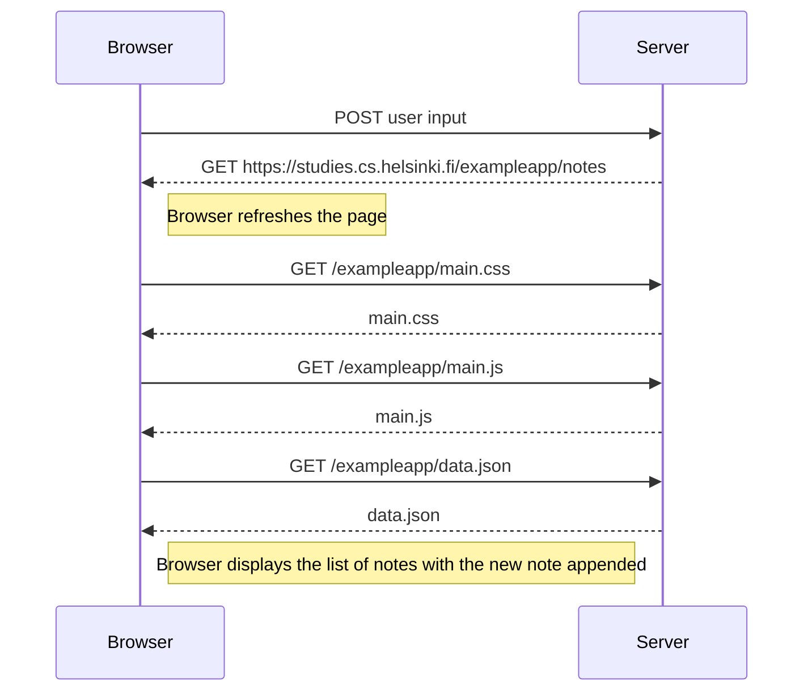

```mermaid
    sequenceDiagram
        participant b as Browser
        participant s as Server
        b->>s: POST user input 
        s-->>b: GET https://studies.cs.helsinki.fi/exampleapp/notes
        Note right of b: Browser refreshes the page
        b->>s: GET /exampleapp/main.css
        s-->>b: main.css
        b->>s: GET /exampleapp/main.js
        s-->>b: main.js
        b->>s: GET 	/exampleapp/data.json
        s-->>b: data.json
        Note right of b: Browser displays the list of notes with the new note appended
```