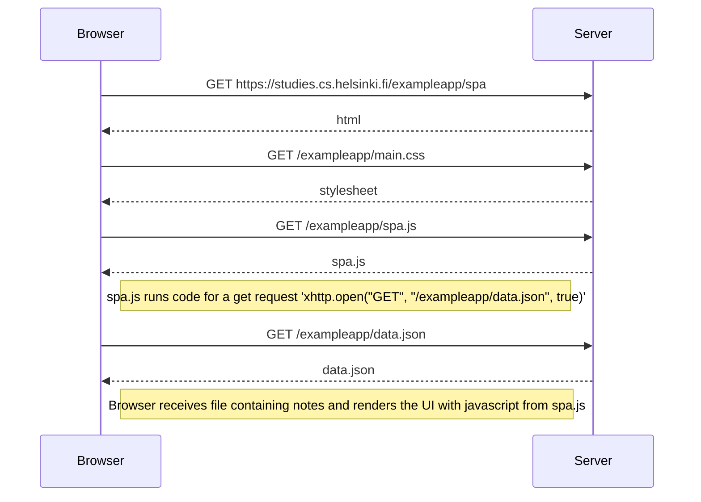

```mermaid
    sequenceDiagram
    participant b as Browser
    participant s as Server
    b->>s: GET https://studies.cs.helsinki.fi/exampleapp/spa
    s-->>b: html
    b->>s: GET /exampleapp/main.css
    s-->>b: stylesheet
    b->>s: GET /exampleapp/spa.js
    s-->>b: spa.js
    note right of b: spa.js runs code for a get request 'xhttp.open("GET", "/exampleapp/data.json", true)'
    b->>s: GET /exampleapp/data.json
    s-->>b: data.json
    note right of b: Browser receives file containing notes and renders the UI with javascript from spa.js
```