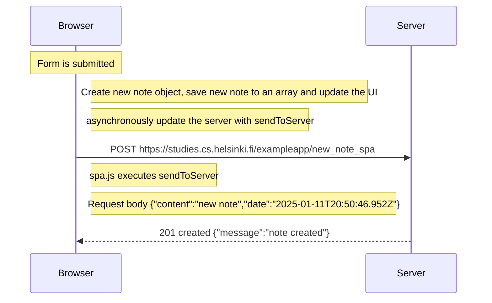

```mermaid
    sequenceDiagram
        participant b as Browser
        participant s as Server
        note over b: Form is submitted
        note right of b: Create new note object, save new note to an array and update the UI
        note right of b: asynchronously update the server with sendToServer
        b->>s: POST https://studies.cs.helsinki.fi/exampleapp/new_note_spa
        note right of b: spa.js executes sendToServer
        note right of b: Request body {"content":"new note","date":"2025-01-11T20:50:46.952Z"}
        s-->>b: 201 created {"message":"note created"}

```     